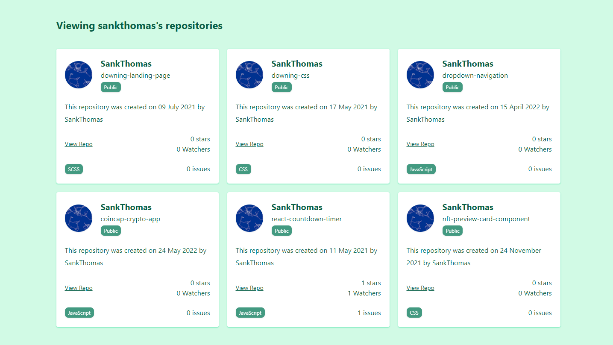

<!--
    // const singleUser = `https://api.github.com/users/DhananjayRakshe`
    // const repos = `https://api.github.com/users/DhananjayRakshe/repos?per_page=5`
    // https://api.github.com/users/DhananjayRakshe/repos?page=1&per_page=10&sort=updated
    I tried my best but on Github API at endpoints i get some confusion. 
    I Tried same task on other API & it works done.
    I used static data for charts now.
    Incase API get expired just wait couple of time and API work again.
    Bydefault user name is DhananjayRakshe and you can change it.
    Search repo by exact name.
    I can also add more features like regex or debouncing but there is time comoplexity.
    In case search is not working just refresh the page.
    Thank you.
 -->